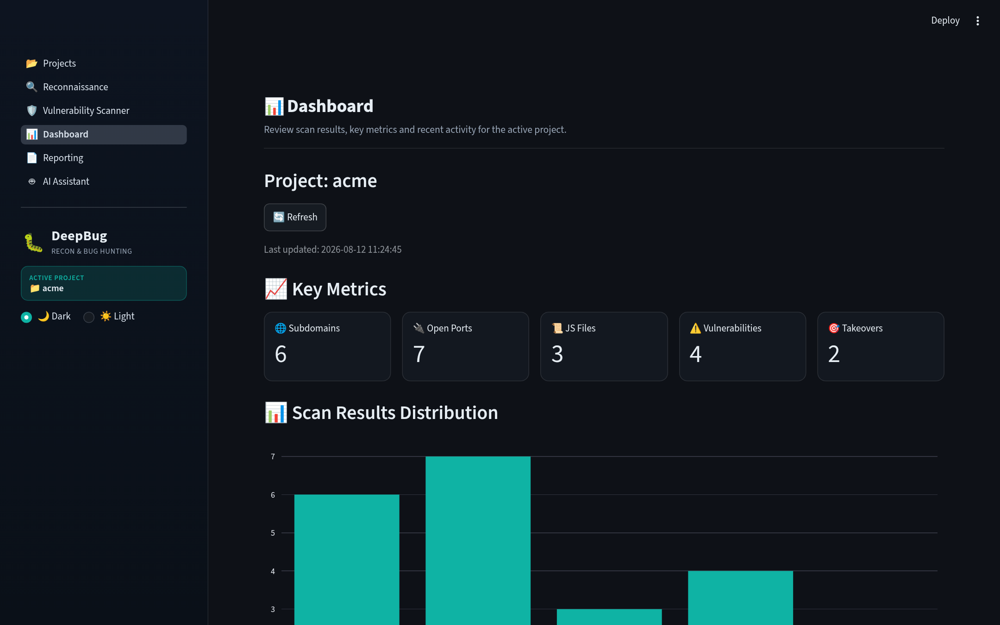
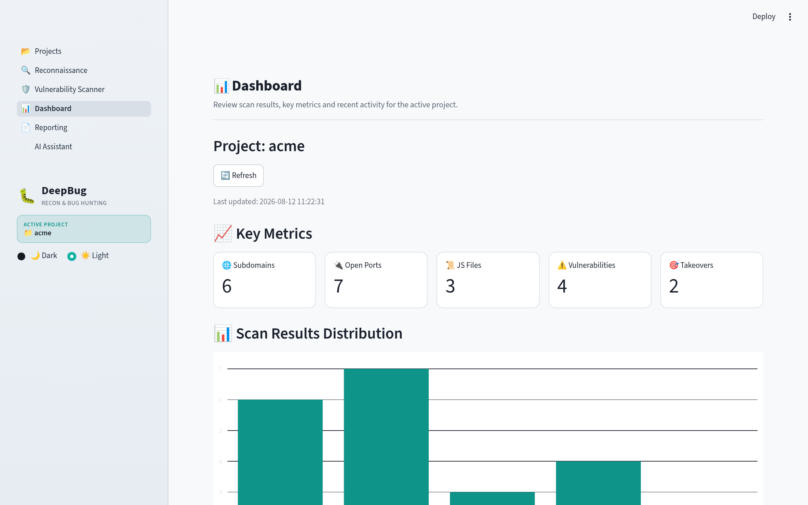
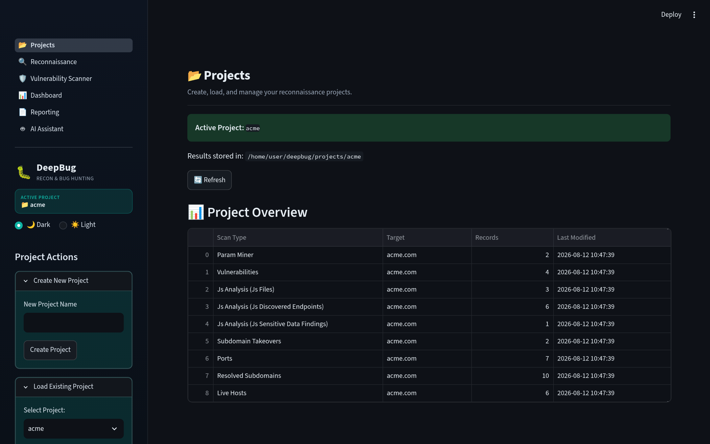
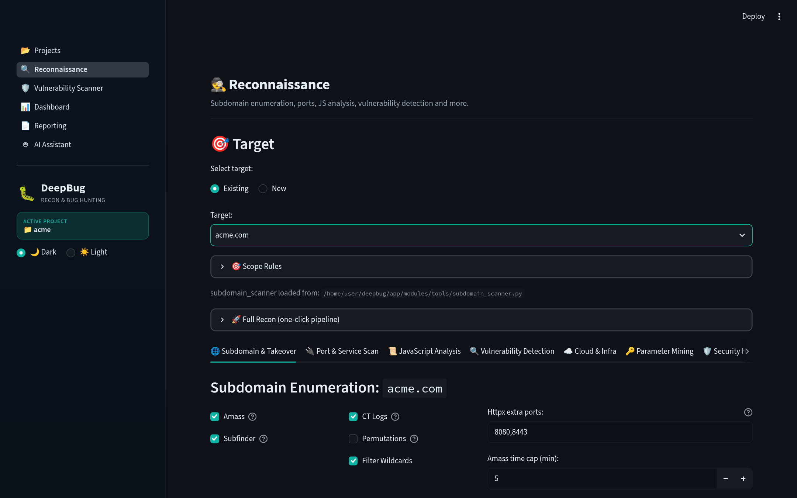
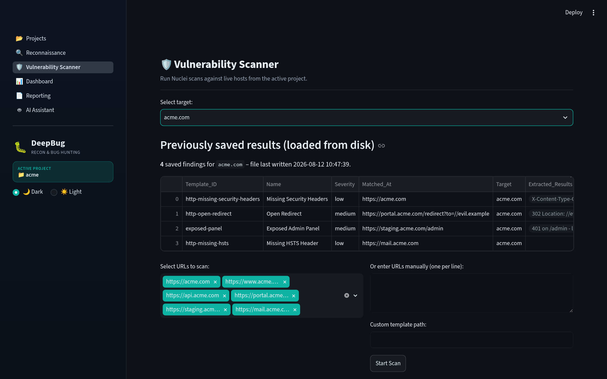
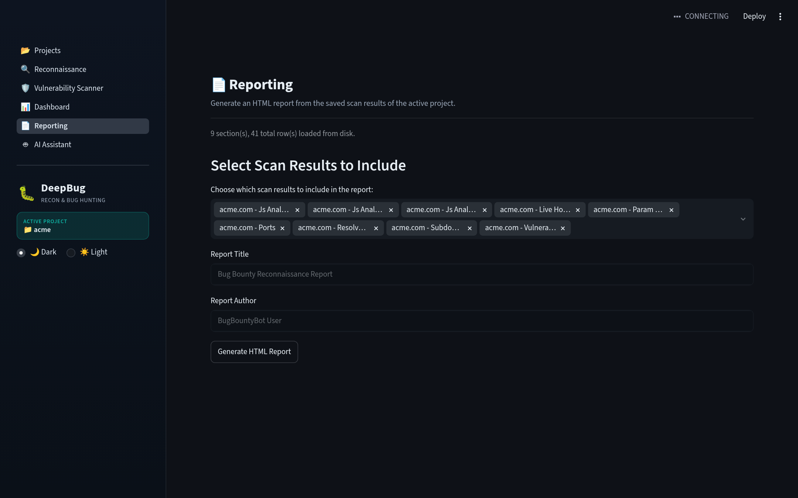
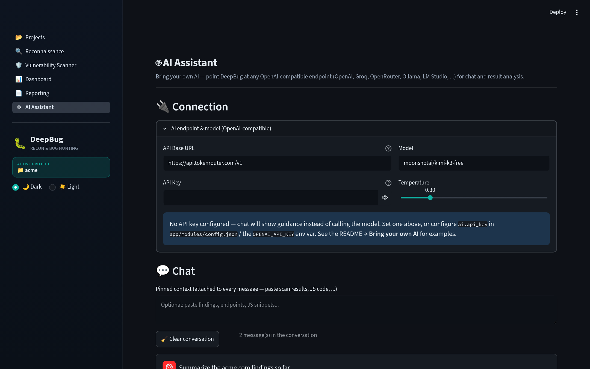

# 🐛 DeepBug

**An automated reconnaissance and bug bounty hunting platform built with Streamlit.**

DeepBug is a self-hosted, browser-based platform that streamlines the whole bug bounty workflow: create a project, run deep reconnaissance against your targets, launch Nuclei scans, review everything on a dashboard, export HTML reports, and optionally bring your own AI to analyze findings. It integrates battle-tested open-source tools — subfinder, amass, nuclei, katana, ffuf, httpx, nmap, and friends — behind one friendly web UI.

---

## ✨ Features

* **📂 Projects** — Create, load, or delete projects. Every scan result is saved per project, per target, straight to disk.
* **🔍 Reconnaissance** — 8 tabs of discovery: subdomain enumeration & takeover checks, port scanning, deep JavaScript analysis, vulnerability detection, cloud & infra probing, parameter mining, security headers, and advanced scans. Powered by **69 tool modules** in `app/modules/tools`.
* **🛡️ Vulnerability Scanner** — Nuclei-based scanning of your live hosts with a live progress UI, results saved to disk and reloadable later.
* **📊 Dashboard** — KPIs, charts, target overview, detailed results, and recent activity across the active project.
* **📄 Reporting** — One-click HTML report generation from all saved scan sections, with a download button.
* **🤖 AI Assistant** — Bring your own AI: chat with pinned context and get summaries, triage, prioritization, and next-step suggestions for saved results — with a built-in heuristic fallback when no API key is configured.

---

## 🧭 Workflow (7 pages)

The app ships with a sidebar navigation in canonical workflow order:

1. **Projects** (`/projects`) — create/load/delete projects, see a per-target scan overview.
2. **Reconnaissance** (`/recon`) — target picker (persisted per project) + 8 scan tabs:
   * 🌐 **Subdomain & Takeover** — subfinder + amass + CT logs in parallel, DNS resolution, httpx probing, takeover checks.
   * 🔌 **Port & Service Scan** — nmap / masscan / naabu.
   * 📜 **JavaScript Analysis** — the v3.0 engine with 9 sub-tabs (overview, secrets & patterns, client-side vectors, endpoints, plus active validation for **prototype pollution, DOM XSS, CORS, open redirect, and SSRF**).
   * 🔍 **Vulnerability Detection** — GF pattern scanning plus kxss confirmation.
   * ☁️ **Cloud & Infra** — cloud enumeration, Shodan, ASN/DNS OSINT.
   * 🔑 **Parameter Mining** — param mining and historical URL hunting.
   * 🛡️ **Security Headers** — header hardening checks.
   * 🧬 **Advanced Scans** — GraphQL, IDOR, race conditions, smuggling, JWT, and more.
3. **Vulnerability Scanner** (`/scanner`) — pick targets from `live_hosts` (or paste URLs manually), run Nuclei in a background thread with a queue-driven progress bar, and save findings to disk as `vulnerabilities`.
4. **Dashboard** (`/dashboard`) — KPI metrics (subdomains, open ports, JS files, vulnerabilities, takeovers), charts, target overview, detailed expandable results, and recent activity (mtime-sorted), plus a refresh button.
5. **Reporting** (`/reporting`) — pick saved scan sections, set a title/author, and generate an escaped, download-ready HTML report.
6. **AI Assistant** (`/ai`) — chat with an OpenAI-compatible endpoint and analyze saved scan results.
7. **Integrations** (`/integrations`) — connect **Burp Suite** (REST API: send live hosts to a scan, import findings and proxy history) and **Caido** (GraphQL: push endpoints into Replay, pull proxy history), plus export **evidence bundles** (HAR + JSONL) captured from findings. See `docs/INTEGRATIONS.md`.

---

## 📸 Screenshots

DeepBug ships with a **dark theme by default** with a **☀️/🌙 theme toggle in the sidebar**
— switch between dark and light at any time; your choice persists across pages.
The screenshots below use a demo project (`acme.com`).

| Dashboard (dark) | Dashboard (light) |
|---|---|
|  |  |

| Projects | Reconnaissance |
|---|---|
|  |  |

| Vulnerability Scanner | Reporting |
|---|---|
|  |  |

| AI Assistant |
|---|
|  |

---

## 🚀 Getting Started

### Prerequisites

* Python 3.13
* [Go](https://golang.org/doc/install) (for the external recon tools)
* A modern browser

### 1. Install Python dependencies

```bash
pip install -r requirements.txt
```

### 2. Install external tools

`app/install.sh` installs the command-line tools DeepBug shells out to (requires `sudo` for apt packages):

* **Go tools**: subfinder, dnsx, nuclei, subjs, webanalyze, httpx, getjs, gf, amass, fakjs, ffuf
* **Nuclei templates**: cloned to `~/nuclei-templates`
* **APT packages**: nmap, masscan
* **Python tools**: paramspider, LinkFinder, cloud_enum

```bash
bash app/install.sh
```

Make sure the Go binary dir is on your `PATH`:

```bash
export PATH=$PATH:$HOME/go/bin
```

### 3. Run

```bash
streamlit run deepbug_app.py
```

Then open http://localhost:8501 — **dark theme by default**, with a **🌙/☀️ theme toggle in the sidebar**
(your choice persists across pages; change the default in `.streamlit/config.toml`).

---

## 🗄️ How Data Is Persisted

Everything is saved per project to disk — no database required:

* Results live at `projects/<project>/<sanitized_target>/<scan_type>_results.json` (atomic writes via temp file + rename, scope-filtered at save time).
* The active project is stored in `.current_project_name.txt`.
* Each project has its own **scope manager** (`.scope.json`) with exact-match, wildcard (`*.example.com`), and exclusion rules. Scope is enforced as a central chokepoint — out-of-scope rows never reach disk.
* Nuclei findings are saved as `vulnerabilities` results and reloaded from disk on the Scanner page.
* The Dashboard and Reporting pages read from disk as the single source of truth.
* AI chat history is persisted per project in `.ai_chat.json`.

---

## 🗂️ Project Structure

```
deepbug/
├── deepbug_app.py            # Entrypoint: config, theme, sidebar + navigation
├── requirements.txt          # Python dependencies
├── app/
│   ├── install.sh            # Installs external tools (go/apt/python)
│   ├── pages/                # The 6 Streamlit pages (workflow order)
│   ├── modules/              # Core logic
│   │   ├── config.json       # Configuration (see below)
│   │   ├── project_manager.py# Persistence + per-project scope manager
│   │   ├── scanner.py        # Nuclei scan engine
│   │   ├── recon.py          # Full-recon pipeline
│   │   ├── reporting.py      # HTML report generation
│   │   ├── utils.py          # Config loading, validators, parsers
│   │   └── tools/            # 69 tool modules: scanners, validators, AI
│   └── utils/                # Theme, logger, subprocess runner, cache, ...
├── .streamlit/config.toml    # Theme + server settings
├── projects/                 # Created at runtime: per-project data
└── docs/                     # Full wiki (index: docs/README.md)
```

---

## ⚙️ Configuration

Configuration lives in **`app/modules/config.json`**, merged over sensible defaults in `app/modules/utils.py` (environment variables like `$HOME` are expanded). Key sections:

* **`project_settings.base_projects_dir`** — where projects are stored (default `./projects`).
* **`tools.paths`** — paths to external binaries: nuclei, subfinder, httpx, nmap, masscan, katana, ffuf, gau, gf, kxss, amass, and more.
* **`experimental`** — feature flags and tuning: `enable_ai`, `SHODAN_API_KEY`, `subprocess_timeout`, and others.
* **`ai`** — AI Assistant settings: `enable`, `api_base`, `api_key`, `model`, `chat_base`, `chat_model`, `chat_temperature`, `chat_max_history`, `chat_max_chars`, `timeout`.

---

## 🤖 Bring Your Own AI

DeepBug never ships with a baked-in LLM key — instead, the AI Assistant points at **any OpenAI-compatible endpoint** (plain HTTP `POST /chat/completions`, no vendor SDK required). It works with:

| Provider | Base URL | Example model |
|----------|----------|---------------|
| OpenAI | `https://api.openai.com/v1` | `gpt-4o-mini` |
| Groq | `https://api.groq.com/openai/v1` | `llama-3.3-70b-versatile` |
| OpenRouter | `https://openrouter.ai/api/v1` | `moonshotai/kimi-k3-free` |
| Ollama (local) | `http://localhost:11434/v1` | `llama3.3`, `qwen2.5` |
| LM Studio (local) | `http://localhost:1234/v1` | any model you serve |

### Via `app/modules/config.json`

Add an `ai` section:

```json
{
  "ai": {
    "enable": true,
    "api_base": "https://api.openai.com/v1",
    "api_key": "sk-...",
    "model": "gpt-4o-mini",
    "chat_base": "https://api.groq.com/openai/v1",
    "chat_model": "llama-3.3-70b-versatile",
    "chat_temperature": 0.3,
    "chat_max_history": 20,
    "chat_max_chars": 6000,
    "timeout": 60
  }
}
```

You can also set the key via the **`OPENAI_API_KEY`** environment variable — DeepBug never stores your key anywhere itself.

### Via the in-app UI (`/ai`)

Open the **AI Assistant** page and use the *Connection* panel: paste the base URL, model name, and API key right in the form — no config file edits needed. The key is held in the session only.

Then:

* **💬 Chat** — talk to the model with an optional *pinned context* (paste scan results or JS code and it's attached to every message). History persists per project.
* **📊 Analyze saved results** — pick any saved result set and run one of four modes: `summary`, `triage`, `prioritize`, or `suggest_next`. If no API key is configured, a built-in **local heuristic fallback** kicks in, so the feature is always usable offline.

---

## 📚 Documentation

See `docs/` for the full wiki (installation, configuration, architecture, AI guide, modules, troubleshooting) — start at `docs/README.md`.

---

## 📄 License

This project is licensed under the [MIT License](LICENSE).
